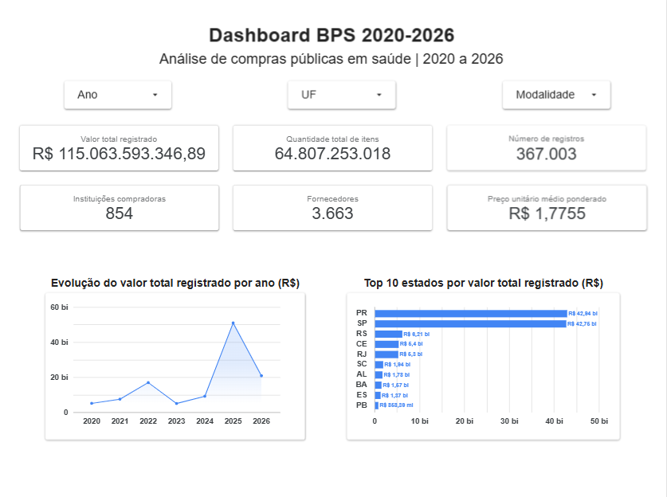
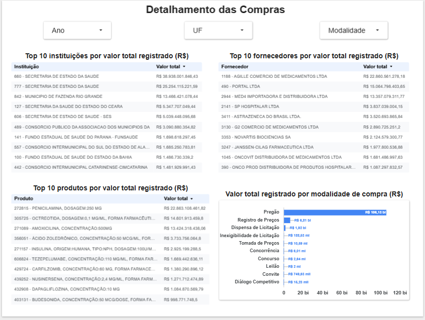
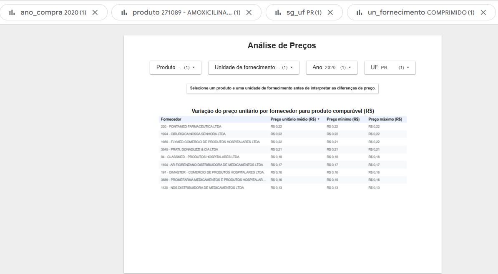
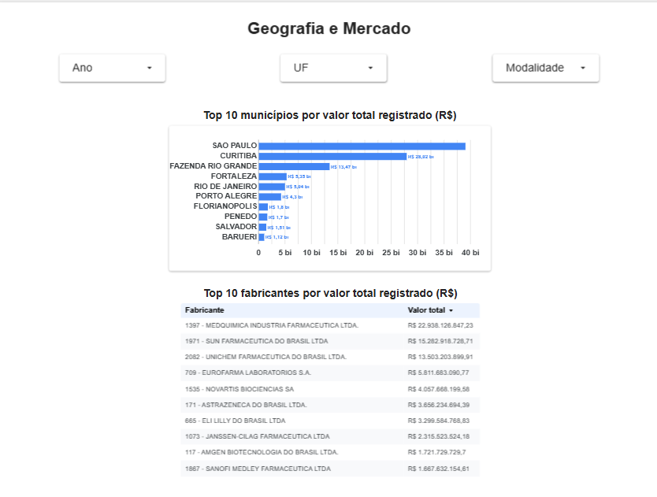

# Mini-Projeto BPS 2020–2026

Mini-projeto de análise de dados do Banco de Preços em Saúde (BPS), desenvolvido no Módulo 2 de Visualização de Dados e Business Intelligence.

## 1. Objetivo do projeto

O objetivo deste projeto é desenvolver uma solução de análise e visualização de dados para acompanhar as compras de medicamentos e dispositivos médicos registradas no Banco de Preços em Saúde (BPS) entre os anos de 2020 e 2026.

A análise busca transformar os dados públicos do BPS em informações que auxiliem na compreensão da evolução das compras, dos valores registrados, das instituições compradoras, dos fornecedores, dos produtos adquiridos e das diferenças de preços encontradas no período.

## 2. Contextualização do problema

A aquisição de medicamentos, materiais hospitalares e dispositivos médicos envolve grande volume de recursos, diferentes instituições, fornecedores, fabricantes e modalidades de compra.

Nesse contexto, a análise dos dados do BPS permite acompanhar os valores registrados, identificar os produtos mais adquiridos, analisar a distribuição das compras entre estados e municípios e investigar diferenças de preços entre transações comparáveis.

As diferenças de preços encontradas não devem ser interpretadas automaticamente como economia, sobrepreço ou irregularidade, pois podem estar relacionadas a fatores como fabricante, apresentação, unidade de fornecimento, quantidade, localidade, modalidade de compra, período e características da negociação.

## 3. Fonte dos dados

Os dados utilizados são provenientes do Banco de Preços em Saúde (BPS), disponibilizado pelo Ministério da Saúde no Portal Brasileiro de Dados Abertos.

Foram utilizadas as bases anuais referentes aos anos de:

2020, 2021, 2022, 2023, 2024, 2025 e 2026.

Também foi consultado o dicionário de dados oficial do BPS para compreensão e validação dos principais campos utilizados na análise.

## 4. Procedimentos para download e concatenação das bases

Os arquivos anuais em formato CSV foram baixados individualmente e armazenados na pasta:

`data/raw/`

Os arquivos foram organizados com os seguintes nomes:

`BPS_2020.csv` até `BPS_2026.csv`.

Durante a análise inicial foi identificado que todos os arquivos possuem 36 colunas, com os mesmos nomes e na mesma ordem. Os arquivos utilizam ponto e vírgula (`;`) como separador.

A consolidação foi realizada em Python com a biblioteca pandas. Cada arquivo anual foi processado individualmente e seus registros foram adicionados ao arquivo consolidado, evitando a necessidade de manter todas as bases simultaneamente na memória.

A base final foi gerada em:

`data/processed/BPS_20_26_BeatrizBruns.csv`

O conjunto consolidado possui 367.003 registros referentes aos anos de 2020 a 2026.

## 5. Tratamentos e transformações realizados

Antes da consolidação, foram realizadas verificações de estrutura, tipos de dados, valores nulos, duplicidades, formatos e inconsistências lógicas.

Foram realizados os seguintes tratamentos:

- validação da estrutura das bases anuais;
- confirmação do encoding UTF-8;
- remoção de espaços extras no início e no final dos campos de texto;
- conversão dos campos `dt_compra` e `dt_insercao` para formato de data;
- tratamento dos campos de CNPJ e outros identificadores como texto;
- conversão e validação dos campos quantitativos e financeiros;
- preservação dos valores nulos quando não havia informação confiável para substituí-los;
- verificação de registros completamente duplicados;
- validação da relação entre quantidade, preço unitário e preço total;
- validação da correspondência entre `ano_compra` e o ano presente em `dt_compra`;
- verificação de quantidades e preços menores ou iguais a zero.

Não foram identificados registros completamente duplicados.

Também não foram encontrados valores inválidos nos principais campos numéricos, datas inválidas, quantidades não positivas ou preços não positivos.

A validação do preço total não apresentou divergências superiores a R$ 0,01 em relação ao cálculo:

`quantidade comprada × preço unitário`.

Algumas colunas apresentam quantidade significativa de valores nulos. Esses valores foram preservados, pois o preenchimento artificial poderia alterar o significado original dos dados.

## 6. Principais colunas utilizadas

Entre as principais colunas disponíveis na base estão:

| Campo | Descrição |
|---|---|
| `ano_compra` | Ano da compra |
| `dt_compra` | Data da compra |
| `no_instituicao` | Instituição compradora |
| `cnpj_instituicao` | CNPJ da instituição |
| `sg_uf` | Unidade Federativa |
| `no_municipio` | Município |
| `co_catmat` | Código do item no CATMAT |
| `ds_item` | Descrição do item |
| `no_fornecedor` | Nome do fornecedor |
| `no_fabricante` | Nome do fabricante |
| `qt_medicamento` | Quantidade adquirida |
| `modalidade` | Modalidade da compra |
| `vl_preco_unitario` | Preço unitário |
| `vl_preco_total` | Valor total registrado |

## 7. KPIs e métricas

Foram definidos os seis KPIs obrigatórios para acompanhamento das compras registradas no BPS.

| KPI | Definição |
|---|---|
| Valor total registrado | Soma do campo `vl_preco_total` |
| Quantidade total de itens comprados | Soma do campo `qt_medicamento` |
| Número de registros de compra | Contagem dos registros da base |
| Instituições compradoras | Contagem distinta de `cnpj_instituicao` |
| Fornecedores | Contagem distinta de `cnpj_fornecedor` |
| Preço unitário médio ponderado | Valor total registrado dividido pela quantidade total de itens comprados |

Os valores de referência calculados sobre a base consolidada de 2020 a 2026 são:

- Valor total registrado: R$ 115.063.593.346,89
- Quantidade total de itens comprados: 64.807.253.018
- Número de registros de compra: 367.003
- Instituições compradoras: 854
- Fornecedores: 3.663
- Preço unitário médio ponderado: R$ 1,7755

O preço unitário médio ponderado foi calculado pela fórmula:

`SUM(vl_preco_total) / SUM(qt_medicamento)`

Esse indicador deve ser interpretado com cuidado quando os filtros incluírem produtos, unidades de fornecimento ou apresentações diferentes.

Como métricas auxiliares para análise da distribuição dos preços, também foram avaliadas a média simples e a mediana do preço unitário. Na base completa, foram encontrados:

- preço unitário médio simples: R$ 172,7928;
- mediana do preço unitário: R$ 1,8600.

A diferença entre essas medidas reforça a necessidade de evitar interpretações baseadas apenas na média simples dos preços unitários.

### Critérios para comparação de preços

As comparações de preços unitários vão ser realizadas prioritariamente entre registros com o mesmo código CATMAT e a mesma unidade de fornecimento.

A análise da base identificou:

- 13.504 códigos CATMAT distintos;
- 44 unidades de fornecimento distintas;
- 9.795 grupos formados por CATMAT e unidade de fornecimento com pelo menos dois registros.

Os campos `co_catmat` e `un_fornecimento` apresentam, respectivamente, 100% e 99,99% de preenchimento, permitindo sua utilização como critérios principais de comparabilidade.

Quando disponíveis, os campos de capacidade e unidade de medida poderão ser utilizados para aumentar a precisão das comparações. Esses campos apresentam aproximadamente 36,39% de preenchimento e, por isso, não serão utilizados como requisito obrigatório para todos os registros.

Fabricante, fornecedor, instituição compradora, localidade, modalidade de compra e período serão utilizados como dimensões adicionais para investigar diferenças de preços.

Os preços unitários não serão somados. Para comparação entre registros comparáveis poderão ser utilizadas medidas como média, mediana, mínimo e máximo, conforme o objetivo da análise.

Diferenças de preço não serão interpretadas automaticamente como economia, sobrepreço ou irregularidade, pois podem estar relacionadas às características específicas de cada aquisição.

## 8. Dashboard

O dashboard foi desenvolvido no Google Data Studio a partir de uma versão otimizada da base consolidada.

Para possibilitar o carregamento dos dados na ferramenta, foi criado o script `python/preparar_looker.py`, responsável por selecionar os campos necessários para as análises e gerar um arquivo auxiliar específico para o dashboard, mantendo os 367.003 registros da base original.

### Link do dashboard

[Dashboard BPS 2020-2026](https://datastudio.google.com/reporting/5159e652-b6bf-40cd-b697-c0990cbe33a6)

### Estrutura do dashboard

O dashboard foi organizado em quatro páginas.

#### Página 1 - Visão Geral

Apresenta os seis KPIs principais do projeto:

- valor total registrado;
- quantidade total de itens comprados;
- número de registros de compra;
- quantidade de instituições compradoras;
- quantidade de fornecedores;
- preço unitário médio ponderado.

Também apresenta:

- evolução do valor total registrado entre 2020 e 2026;
- Top 10 estados por valor total registrado;
- filtros interativos de ano, UF e modalidade.

#### Página 2 - Detalhamento das Compras

Apresenta análises de concentração das compras por:

- Top 10 instituições por valor total registrado;
- Top 10 produtos por valor total registrado;
- Top 10 fornecedores por valor total registrado;
- valor total registrado por modalidade de compra.

A página também possui filtros de ano, UF e modalidade.

#### Página 3 - Análise de Preços

Destinada à investigação de diferenças de preços entre registros comparáveis.

A comparação utiliza filtros de:

- produto;
- unidade de fornecimento;
- ano;
- UF.

Para cada fornecedor são apresentados:

- preço unitário médio;
- preço unitário mínimo;
- preço unitário máximo.

As diferenças observadas devem ser interpretadas com cautela e somente após a seleção de produtos e unidades de fornecimento comparáveis.

#### Página 4 - Geografia e Mercado

Apresenta:

- Top 10 municípios por valor total registrado;
- Top 10 fabricantes por valor total registrado;
- filtros de ano, UF e modalidade.

O dashboard possui mais de cinco visualizações, além dos cartões de KPI e dos filtros interativos.

### Imagens do dashboard

#### Visão Geral



#### Detalhamento das Compras



#### Análise de Preços



#### Geografia e Mercado



## 9. Principais análises e descobertas

A análise dos 367.003 registros consolidados entre 2020 e 2026 permitiu identificar padrões de evolução temporal, concentração geográfica, participação de instituições, fornecedores e fabricantes, além de diferenças de preços entre registros comparáveis.

### Evolução do valor registrado

O ano de 2025 apresentou o maior valor total registrado no período, com aproximadamente R$ 50,90 bilhões, correspondendo a cerca de 44,2% do valor total da base.

Entretanto, 2025 não foi o ano com a maior quantidade adquirida. O maior volume em quantidade ocorreu em 2022, com aproximadamente 15,21 bilhões de unidades registradas.

Esse resultado mostra que a evolução do valor financeiro não acompanha necessariamente a evolução da quantidade comprada, podendo ser influenciada pelo tipo de produto adquirido, preço unitário, apresentação, volume das contratações e demais características das compras.

O ano de 2026 deve ser interpretado com cautela, pois a base utilizada contém apenas os registros disponíveis até o período de extração e pode não representar um ano completo.

### Distribuição geográfica

Paraná e São Paulo apresentaram os maiores valores registrados entre as unidades federativas analisadas.

O Paraná totalizou aproximadamente R$ 42,94 bilhões e São Paulo cerca de R$ 42,75 bilhões. Em conjunto, os dois estados representam aproximadamente 74,5% do valor total registrado na base.

Entre os municípios, São Paulo apresentou o maior valor total, seguido por Curitiba e Fazenda Rio Grande.

Essa concentração indica a importância de analisar separadamente os principais estados e municípios para compreender quais registros, instituições e produtos contribuem para os maiores volumes financeiros.

### Instituições compradoras

A análise por instituição foi realizada utilizando o CNPJ como identificador, evitando agrupar instituições diferentes que possuam nomes iguais ou semelhantes.

As maiores instituições em valor registrado apresentaram forte participação no total da base. Duas instituições denominadas "SECRETARIA DE ESTADO DA SAUDE", por exemplo, possuem CNPJs distintos e foram analisadas separadamente, registrando aproximadamente R$ 38,94 bilhões e R$ 25,25 bilhões.

Esse resultado demonstra a importância de utilizar identificadores únicos nas análises, e não apenas o nome textual das instituições.

### Produtos

Os produtos com maiores valores totais registrados foram:

1. Penicilamina 250 mg;
2. Octreotida 0,1 mg/ml;
3. Amoxicilina 500 mg.

Somados, esses três produtos representam aproximadamente 44,2% do valor total registrado no período.

Por outro lado, os produtos com maior quantidade adquirida são diferentes. Entre eles aparecem dieta enteral, amitriptilina 25 mg, losartana 50 mg, hidroclorotiazida 25 mg e omeprazol 20 mg.

Essa diferença reforça que produtos com maior valor financeiro não são necessariamente aqueles adquiridos em maior quantidade.

### Fornecedores e fabricantes

A análise por fornecedor e fabricante também utilizou o CNPJ para distinguir corretamente empresas que possuam nomes semelhantes ou mais de um cadastro.

Entre os fornecedores, os maiores valores registrados foram observados para Agille Comércio de Medicamentos Ltda., Portal Ltda. e Med4 Importadora e Distribuidora Ltda.

Entre os fabricantes, destacaram-se Medquímica Indústria Farmacêutica Ltda., Sun Farmacêutica do Brasil Ltda. e Unichem Farmacêutica do Brasil Ltda.

Esses resultados evidenciam concentração relevante do valor registrado em determinados agentes do mercado, mas não permitem, isoladamente, concluir sobre competitividade, eficiência ou condições comerciais.

### Modalidades de compra

O Pregão foi a modalidade com maior participação financeira, somando aproximadamente R$ 106,13 bilhões, ou cerca de 92,2% de todo o valor registrado na base.

Na sequência aparecem Registro de Preços e Dispensa de Licitação.

A elevada participação do Pregão demonstra sua relevância nos registros analisados e justifica sua utilização como uma dimensão importante para filtros e investigações no dashboard.

### Investigação de diferenças de preços

Para investigar a variação de preços entre registros mais comparáveis, foi selecionado o CATMAT 271089, correspondente à Amoxicilina 500 mg, com unidade de fornecimento "COMPRIMIDO".

Inicialmente foram encontrados 190 registros distribuídos entre 2020 e 2026, envolvendo 106 fornecedores e 18 unidades federativas.

Para reduzir diferenças relacionadas a período e localização, foi escolhido o recorte de 2021 no estado do Piauí, que apresentou 18 registros e 9 fornecedores distintos.

Nesse recorte foram identificadas:

- 18 compras registradas;
- 9 fornecedores;
- 17 instituições compradoras;
- 1 fabricante.

O preço unitário variou entre R$ 0,0038 e R$ 0,6800. A mediana foi de R$ 0,2750 e o preço médio ponderado pela quantidade foi de aproximadamente R$ 0,3001.

Mesmo após restringir produto, unidade de fornecimento, ano, estado e fabricante, permaneceram diferenças importantes entre os preços registrados.

Entretanto, essas diferenças não representam automaticamente economia, sobrepreço ou irregularidade. Outros fatores podem influenciar os valores, como quantidade adquirida, instituição compradora, modalidade da compra, condições de negociação, apresentação do produto e características específicas de cada contratação.

O valor mínimo de R$ 0,0038 também se mostrou muito distante dos demais registros do grupo, sendo um exemplo de observação que merece verificação individual na fonte antes de qualquer conclusão.

## 10. Recomendações

Com base nas análises realizadas, recomenda-se utilizar o dashboard principalmente como ferramenta de apoio à investigação e priorização de registros que mereçam análise mais detalhada.

Diferenças relevantes de preço devem ser avaliadas somente entre produtos realmente comparáveis, priorizando o mesmo código CATMAT, unidade de fornecimento, apresentação, período e localização. Quando disponíveis, informações como capacidade, unidade de medida, fabricante, fornecedor, modalidade e quantidade também devem ser consideradas.

Registros com valores muito distantes da distribuição observada, como preços unitários extremamente baixos ou elevados, devem ser verificados diretamente na base de origem antes de qualquer interpretação.

Também é recomendável acompanhar separadamente estados, municípios, instituições, produtos, fornecedores e fabricantes que concentram valores elevados, buscando entender quais fatores explicam essa participação.

O dashboard pode ser utilizado como ponto de partida para análises futuras mais específicas, incluindo comparação entre períodos, instituições e modalidades de aquisição.

## 11. Limitações

A análise apresenta algumas limitações que devem ser consideradas na interpretação dos resultados.

A base do BPS possui campos com diferentes níveis de preenchimento. Algumas variáveis apresentam elevada quantidade de valores ausentes, principalmente em determinados anos. Esses campos foram preservados como nulos, evitando preenchimentos artificiais que poderiam distorcer as análises.

Também foram identificadas mudanças no nível de preenchimento de alguns campos ao longo dos anos, como o número da ata, o que limita comparações históricas utilizando essas variáveis.

Os valores analisados representam registros existentes no BPS e não devem ser interpretados automaticamente como o total de gastos em saúde de cada estado, município ou instituição.

O ano de 2026 pode representar um período parcial, dependendo da data de atualização e extração dos arquivos utilizados.

A comparação de preços exige atenção especial. Produtos com o mesmo CATMAT ainda podem apresentar diferenças de apresentação, capacidade, unidade de medida, fabricante, quantidade, localização, período, modalidade ou condições de negociação.

Na versão otimizada utilizada no Google Data Studio, alguns campos menos completos, como capacidade e unidade de medida da capacidade, não foram incluídos devido à necessidade de reduzir o tamanho do arquivo para respeitar o limite de upload da ferramenta. Dessa forma, a página de análise de preços utiliza principalmente produto e unidade de fornecimento como critérios de comparabilidade, complementados por ano e UF.

Por esse motivo, diferenças de preços apresentadas no dashboard devem ser utilizadas como sinal para investigação e não como evidência automática de economia, sobrepreço ou irregularidade.

## 12. Instruções para reprodução do projeto

### 1. Clonar o repositório

O projeto utiliza Git LFS para o versionamento dos arquivos de dados de maior tamanho.

```bash
git lfs install
git clone https://github.com/brunsbea/mini-projeto-bps-2020-2026.git
cd mini-projeto-bps-2020-2026
git lfs pull
```

### 2. Preparar o ambiente Python

É necessário possuir Python instalado e a biblioteca `pandas`.

```bash
pip install pandas
```

### 3. Bases de dados

Os arquivos anuais originais do BPS estão armazenados em:

```text
data/raw/
```

Os arquivos utilizados correspondem aos anos de 2020 a 2026.

### 4. Executar a consolidação

Para tratar e consolidar as bases anuais:

```bash
python python/consolidar_bps.py
```

O arquivo consolidado é gerado em:

```text
data/processed/BPS_20_26_BeatrizBruns.csv
```

### 5. Validar os KPIs e os critérios de comparabilidade

Para calcular e validar os principais indicadores:

```bash
python python/calcular_kpis.py
```

Para verificar os critérios utilizados nas comparações de preços:

```bash
python python/verificar_comparabilidade.py
```

### 6. Executar as análises

Para reproduzir os rankings, as análises temporais, geográficas e a investigação de preços:

```bash
python python/analisar_resultados.py
```

### 7. Preparar a base utilizada no dashboard

Devido ao limite de tamanho para upload no Google Data Studio, foi criada uma versão otimizada da base consolidada.

Para gerar esse arquivo:

```bash
python python/preparar_looker.py
```

O arquivo auxiliar é criado em:

```text
data/looker/BPS_Looker_2020_2026.csv
```

A pasta `data/looker/` não é versionada no Git, pois o arquivo pode ser reproduzido pelo script.

### 8. Dashboard

O arquivo otimizado pode ser carregado no Google Data Studio para reprodução das visualizações.

As configurações dos KPIs, filtros, páginas e análises utilizadas no projeto estão descritas na seção 8 deste README.
